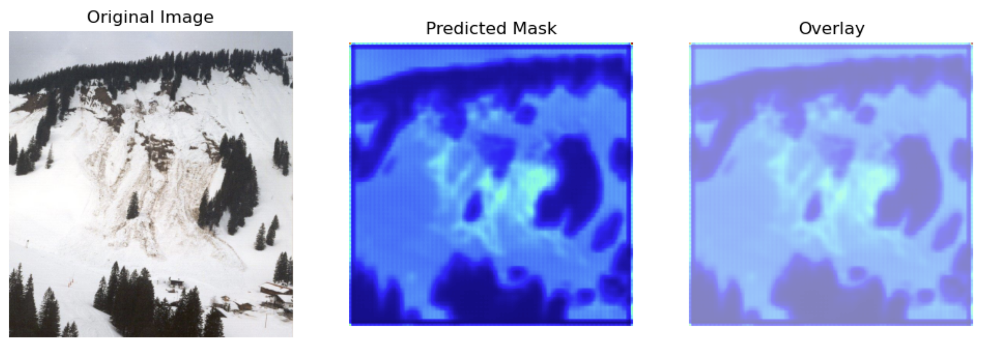
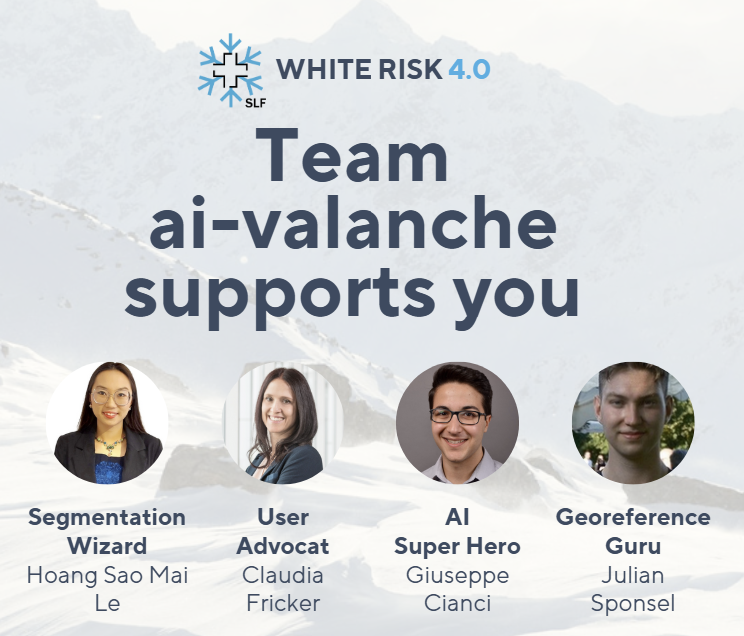

# AI-Avalanche-Detection---Hackathon-Davos-2025

## The project
Using computer vision, I built a segmentation model to detect avalanche zones in mountain images.  
I use a U-Net model.

## The challenges 
I initially tried using a pre-trained GitHub model, but integration issues pushed me to develop my own U-Net architecture from scratch. I faced challenges due to the visual similarity between snow and avalanches, which I solved by applying a custom weighted loss function to address class imbalance.

Here is an overview:  

  

## The whole project 
### Our vision
We aim to save more lives and establish avalanche-safe conditions by fully utilizing AI and geolocation technology. Our intuitive and seamless user experience fosters a more connected and empowered community, enabling individuals to support each other.  
Aside from the AI segmentation map, we also build together: 

* Geolocalization given a picture 
* Segmentation detection of avalanches
* Spam detections of pictures that are not mountains

The whole github repository is here: https://github.com/Giuspepe/aivalanche 

Contributor: Hoang Sao Mai Le, Claudia Fricker, Giuseppe CIanci, Julian Sponsei  

